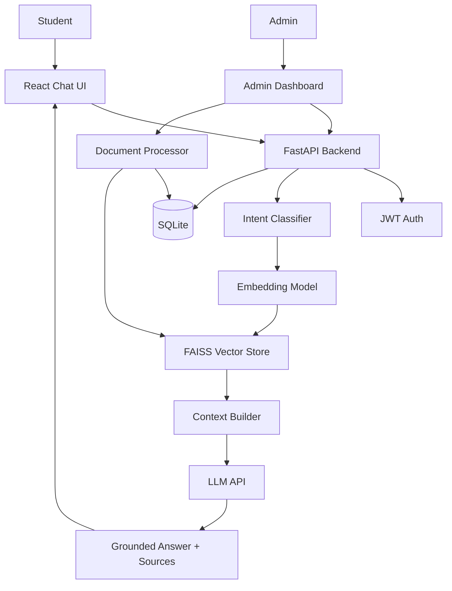

# College AI Student Assistant

AI-powered student assistance chatbot for college students. This academic mini-project combines **intent classification (ML)**, **semantic search**, **RAG (AI)**, and a **React + FastAPI** full-stack application.

Students ask college-related questions and receive **grounded answers** from an admin-managed document knowledge base — with **source citations** and **hallucination prevention**.

---

## Features

- Student registration, login, JWT authentication
- Admin dashboard for document management and analytics
- Document ingestion: PDF, TXT, DOCX, CSV
- Text cleaning, chunking, and metadata storage
- Sentence-transformer embeddings + FAISS vector search
- TF-IDF + Logistic Regression intent classifier (trained locally)
- RAG pipeline with configurable LLM provider
- Chat UI with history, intent display, and source citations
- SQLite persistence for users, documents, and conversations

---

## Architecture



### How RAG works

1. Student submits a question
2. Intent classifier labels the question (e.g. `attendance`)
3. Question is embedded with `all-MiniLM-L6-v2`
4. FAISS retrieves top-k similar document chunks
5. Retrieved chunks form the LLM context
6. LLM generates an answer **only from that context**
7. Response includes source document names and page numbers

### How intent classification works

1. Training data in `backend/training/intents.csv` (288 examples, 12 intents)
2. Text preprocessing (lowercase, punctuation normalization)
3. TF-IDF vectorization (unigrams + bigrams)
4. Logistic Regression classifier
5. 80/20 stratified train/test split
6. Metrics saved to `backend/data/models/intent_metrics.json`
7. Model loaded at runtime from `intent_classifier.joblib`

**Reported evaluation metrics (from actual test split):**

| Metric | Value |
|--------|-------|
| Training examples | 288 |
| Test examples | 58 |
| Accuracy | 0.776 |
| Precision | 0.801 |
| Recall | 0.776 |
| F1 score | 0.776 |

---

## Project Structure

```
AI-Chatbot/
├── backend/
│   ├── app/
│   │   ├── api/              # REST routes (auth, chat, admin, documents)
│   │   ├── core/             # Config, security, JWT
│   │   ├── db/               # SQLAlchemy models
│   │   ├── ml/               # Intent classifier training pipeline
│   │   ├── schemas/          # Pydantic request/response models
│   │   ├── services/         # Business logic (RAG, embeddings, LLM)
│   │   └── utils/            # Text processing helpers
│   ├── data/
│   │   ├── documents/        # Uploaded + sample college documents
│   │   ├── models/           # Trained intent classifier + metrics
│   │   └── vector_store/     # FAISS index + metadata
│   ├── scripts/
│   │   ├── create_admin.py
│   │   └── seed_knowledge_base.py
│   ├── training/intents.csv
│   ├── tests/
│   └── requirements.txt
├── frontend/
│   └── src/
│       ├── components/       # Chat UI, admin upload, messages
│       ├── pages/            # Login, Chat, AdminDashboard
│       └── services/api.js
└── README.md
```

---

## Prerequisites

- Python 3.11+
- Node.js 18+
- npm
- OpenAI-compatible LLM API key (for live chat answers)

---

## Installation

### 1. Backend

```bash
cd backend
python3 -m venv venv
source venv/bin/activate          # Windows: venv\Scripts\activate
pip3 install -r requirements.txt
cp .env.example .env
```

Edit `.env` and set at minimum:

```env
JWT_SECRET=your-secure-secret
LLM_API_KEY=your-openai-api-key
```

### 2. Train the intent classifier

```bash
PYTHONPATH=. python -m app.ml.train_model
```

### 3. Create admin user

```bash
PYTHONPATH=. python scripts/create_admin.py --email admin.user@vsit.edu.in --password adminpass1
```

### 4. Seed sample knowledge base (optional, recommended for demo)

```bash
PYTHONPATH=. python scripts/seed_knowledge_base.py
```

### 5. Start backend

```bash
    uvicorn app.main:app --reload --host 127.0.0.1 --port 8000
```

Verify: http://127.0.0.1:8000/health → `{"status":"ok"}`

API docs: http://127.0.0.1:8000/docs

### 6. Frontend

```bash
cd frontend
npm install
npm run dev
```

Open: http://localhost:5173

## Student Registration

Students register with their VSIT email in the format `name.surname@vsit.edu.in`.

- Fill in first name, surname, email, password, and confirm password
- The backend validates the email format and creates the account
- A JWT token is returned immediately — you can start chatting right away

---

## Viva Demo Checklist

1. **Student registers/logs in** at the chat UI
2. Ask: *"What is the minimum attendance requirement?"*
3. Show intent prediction: `attendance`
4. Explain embedding → FAISS retrieval → context → LLM
5. Show grounded answer with **source documents**
6. Ask a second question and show **chat history**
7. **Admin logs in** → Admin Dashboard
8. Upload a new college PDF/TXT
9. Re-index documents if needed
10. Student asks a question related to the new document
11. Show **ML metrics** panel with real trained values
12. Show `/docs` API and project folder structure

---

## API Endpoints

### Authentication

| Method | Endpoint | Description |
|--------|----------|-------------|
| POST | `/api/auth/register` | Register student |
| POST | `/api/auth/login` | Login and receive JWT |
| GET | `/api/auth/me` | Current user profile |

### Chat (Student)

| Method | Endpoint | Description |
|--------|----------|-------------|
| POST | `/api/chat` | Send message, receive grounded answer |
| POST | `/api/chat/session` | Create chat session |
| GET | `/api/chat/history` | List chat sessions |
| GET | `/api/chat/{session_id}` | Session message history |

### Admin

| Method | Endpoint | Description |
|--------|----------|-------------|
| GET | `/api/admin/statistics` | Dashboard stats |
| GET | `/api/admin/ml-metrics` | Intent model metrics |
| POST | `/api/admin/documents/upload` | Upload document |
| GET | `/api/admin/documents` | List documents |
| DELETE | `/api/admin/documents/{id}` | Delete document |
| POST | `/api/admin/documents/reindex` | Rebuild FAISS index |

---

## Testing

```bash
# Backend (44+ tests)
cd backend
source venv/bin/activate
pytest

# Frontend
cd frontend
npm test
npm run build
```

Tests cover authentication, document processing, chunking, embeddings, FAISS retrieval, intent classification, chat pipeline, admin authorization, LLM mocking, and UI components.

---

## Technologies

| Layer | Stack |
|-------|-------|
| Backend | Python, FastAPI, SQLAlchemy, SQLite |
| Frontend | React, Vite |
| ML | scikit-learn, TF-IDF, Logistic Regression |
| AI / NLP | sentence-transformers, FAISS, RAG, OpenAI-compatible LLM |
| Auth | JWT, bcrypt password hashing |
| Testing | pytest, Vitest |

---

## Security Notes

- Passwords are hashed with bcrypt
- JWT secret must be changed in production
- API keys loaded from environment variables only
- Admin routes protected by role-based authorization
- Internal stack traces are not exposed to clients

---

## Future Improvements

- OAuth / SSO integration
- PostgreSQL for production deployment
- Streaming LLM responses in the chat UI
- PDF page-level citation improvements
- Conversation analytics dashboard
- Docker Compose deployment
- Fine-tuned domain embeddings on college corpus

---

## License

Academic mini-project — for educational use.
# AI-Powered-ChatBot-for-VSIT-Student
